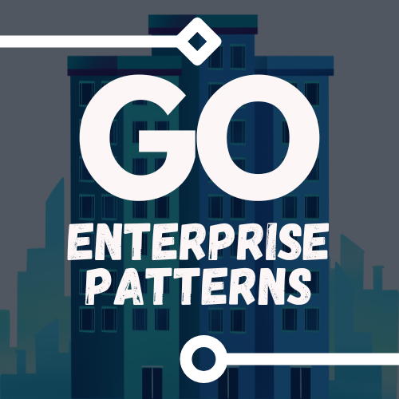

    
    <h1 style="font-family: 'Yu Gothic'">Patterns of Enterprise Applications in Go</h1>
    
A bunch of examples of the patterns described by Fowler in Go

# Index

1. Domain Logic Patterns
   - [Transaction Script](./01-domain-logic/01-transaction-script)
   - [Domain Model](./01-domain-logic/02-domain-model)
   - [Table Module](./01-domain-logic/03-table-module)
   - [Service Layer](./01-domain-logic/04-service-layer)
2. Data Source Architectural Patterns
   - [Table Data Gateway](./02-data-source-architectural/01-table-data-gateway)
   - [Row Data Gateway](./02-data-source-architectural/02-row-data-gateway)
   - [Active Record](./02-data-source-architectural/03-active-record)
   - [Data Mapper](./02-data-source-architectural/04-data-mapper)
3. Object-Relational Behavioral Patterns
   - [Unit Of Work](./03-object-relational-behavioral/01-unit-of-work)
   - [Identity Map](./03-object-relational-behavioral/02-identity-map)
   - [Lazy Load](./03-object-relational-behavioral/03-lazy-load)
4. Object-Relational Structural Patterns
   - [Identity Field](./04-object-relational-structural/01-identity-field)
   - [Foreign Key Mapping](./04-object-relational-structural/02-foreign-key-mapping)
   - [Association Table Mapping](./04-object-relational-structural/03-association-table-mapping)
   - [Dependent Mapping](./04-object-relational-structural/04-dependent-mapping)
   - [Embedded Value](./04-object-relational-structural/05-embedded-value)
   - [Serialized LOB](./04-object-relational-structural/06-serialized-lob)
